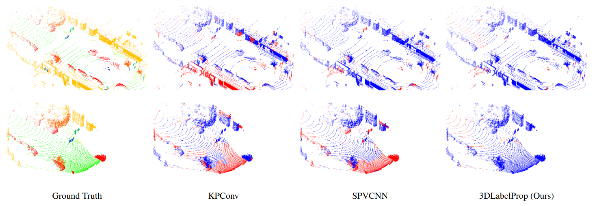

# 3DLabelProp

Example of the segmentation error on Pandaset64 and PandasetFF with KPConv, SPVCNN and 3DLabelProp. All models trained with SemanticKITTI.

This repository is the implementation of Domain generalization of 3D semantic segmentation in autonomous driving. 

The Paper can be found [here](https://arxiv.org/abs/2212.04245).

## Installation

### Hardware and Software

This repository was tested on Ubuntu 18.04, with python 3.7.13, pytorch 1.7.1, CUDA 11.1 and gcc 7.5.0.

### C++ requirements

- mlpack (https://www.mlpack.org/)
- openmp
- pybind11 (https://github.com/pybind/pybind11)
- armadillo (https://arma.sourceforge.net/)

### Cuda requirements

This code was tested with CUDA 11.1

### Python requirements
- install pytorch, here with conda

`conda create --name 3DLabelProp python=3.7`

`conda activate 3DLabelProp`

- install requirements

`pip install -r requirements.txt`

- install torch

`conda install pytorch==1.7.1 torchvision torchaudio cudatoolkit=11.0 -c pytorch`

If you use SPVCNN, torchsparse is a requirements. Otherwise it is optionnal but recommended.
- install torchsparse https://github.com/mit-han-lab/torchsparse

### Compilation of C++

`cd cpp_wrappers`

`bash compile_wrappers.sh`

## Usage

### Train
Be careful, for training, we preprocess the dataset. For example, for SemanticKITTI with the default parameters, you need approximately 220Go of free storage, for nuScenes 210Go. 

Change the paths appropriately in the various config files (./cfg).

Trajectory files can be found at: https://cloud.minesparis.psl.eu/index.php/s/Kbh6g54aTTih4NE. Trajectories for nuScenes, SemanticKITTI and SemanticPOSS were obtained with CT-ICP (https://github.com/jedeschaud/ct_icp).

Put the unzipped folder at the root of the dataset.

By default, to train a model on SemanticKITTI with KPConv use:

`python train.py -cfg ./cfg/train_sk.yaml`

### Inference
Be careful, by default, inferences as saved on disk for future use.

Change the paths appropriately in the various config files.

If you use KPConv pretrained_models, also download the "kpconv_files" folder, and put it in the folder that the clust_cfg points to (clust_cfg.savepath/source_dataset/clust_cfg.name). 

By default, to infer a model trained on SemanticKITTI with KPConv on PandaFF use:

`python infer.py -cfg ./cfg/infer_sk_pff.yaml`

### Add dataset and models
Please refer to the ReadMe of the relevant sections [add a new dataset](./datasets/README.md) and [add a new model](./models/README.md).

## Trained models
Trained models on SemanticKITTI and nuScenes with KPConv can be found at https://cloud.minesparis.psl.eu/index.php/s/JVFUDxAyL2IRXCQ.

## Pandaset
To compute our results on Pandaset, we extracted PandaFF and Panda64 that we put back in the sensor referential. Our preprocessed scan can be found at: [PandaFF](https://cloud.minesparis.psl.eu/index.php/s/CXMMrShTfKoLZEp) and [Panda64](https://cloud.minesparis.psl.eu/index.php/s/viYCe1ChOd668pA).

## Credits

Thanks to the original authors of KPConv (https://github.com/HuguesTHOMAS/KPConv-PyTorch) from which we copied the KPConv backbone code and SPVCNN (https://github.com/mit-han-lab/spvnas) from which we copied the SPVCNN backbone code.

If you use this repo please cite us:

@misc{sanchez2023domain,
      title={Domain generalization of 3D semantic segmentation in autonomous driving}, 
      author={Jules Sanchez and Jean-Emmanuel Deschaud and Francois Goulette},
      year={2023},
      eprint={2212.04245},
      archivePrefix={arXiv},
      primaryClass={cs.CV}}
